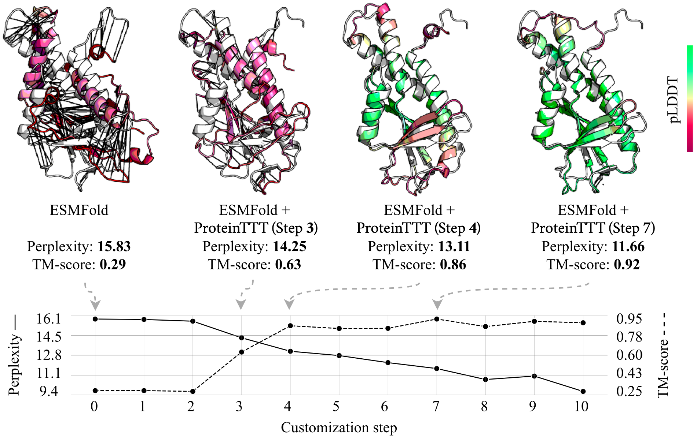

# ProteinTTT

<p align="center">
  
</p>

ProteinTTT is a package that allows you to use test-time training (TTT) to improve the performance of protein language models via on-the-fly per-protein customization.

## Installation

Please first install the model you are planning to use with ProteinTTT and then install the package itself:

```bash
git clone https://github.com/anton-bushuiev/ProteinTTT && pip install -e ProteinTTT
```

## Usage

In the following example, we use ESMFold+ProteinTTT to predict the structure of a protein. Here, customizing ESMFold with ProteinTTT leads to structure prediction with twice higher pLDDT.

```python
import torch
import esm
import biotite.structure.io as bsio
from proteinttt.models.esmfold import ESMFoldTTT, DEFAULT_ESMFOLD_TTT_CFG

# Set your sequence
sequence = "GIHLGELGLLPSTVLAIGYFENLVNIICESLNMLPKLEVSGKEYKKFKFTIVIPKDLDANIKKRAKIYFKQKSLIEIEIPTSSRNYPIHIQFDENSTDDILHLYDMPTTIGGIDKAIEMFMRKGHIGKTDQQKLLEERELRNFKTTLENLIATDAFAKEMVEVIIEE"

# Load model
model = esm.pretrained.esmfold_v1()
model = model.eval().cuda()

def predict_structure(model, sequence):
    with torch.no_grad():
        output = model.infer_pdb(sequence)

    with open("result.pdb", "w") as f:
        f.write(output)

    struct = bsio.load_structure("result.pdb", extra_fields=["b_factor"])
    print('pLDDT:', struct.b_factor.mean())

predict_structure(model, sequence)
# pLDDT: 38.43025

# ============ ProteinTTT =============
ttt_cfg = DEFAULT_ESMFOLD_TTT_CFG
ttt_cfg.steps = 10  # This is how you can modify config
model = ESMFoldTTT.ttt_from_pretrained(model, ttt_cfg=ttt_cfg, esmfold_config=model.cfg)
model.ttt(sequence)
# =====================================

predict_structure(model, sequence)
# pLDDT: 78.69619

# Reset model to original state (after this model.ttt can be called again on another protein)
# ============== ProteinTTT ===========
model.ttt_reset()
# =====================================
```

See `notebooks/demo.ipynb` for more usage examples.

## Implementing ProteinTTT for your custom model

The abstract class `proteinttt.base.TTTModule` implements all core functionality of ProteinTTT, including batch construction, optimization, and logging. To implement ProteinTTT for your custom model, you can subclass `TTTModule` and implement several methods that specify your model's interface (the alphabet and logic for predicting logits). Optionally, you can also implement logic for evaluating the model during test-time training to select the optimal step. For an example implementation, see how ProteinTTT is implemented for ESMFold in `ProteinTTT/proteinttt/models/esmfold.py`. The submodule `ProteinTTT/proteinttt/models` contains other examples.

## References

If you use ProteinTTT in your research, please cite the following paper:

```bibtex
@article{bushuiev2024training,
  title={Training on test proteins improves fitness, structure, and function prediction},
  author={Bushuiev, Anton and Bushuiev, Roman and Zadorozhny, Nikola and Samusevich, Raman and St{\"a}rk, Hannes and Sedlar, Jiri and Pluskal, Tom{\'a}{\v{s}} and Sivic, Josef},
  journal={arXiv preprint arXiv:2411.02109},
  url={https://arxiv.org/abs/2411.02109},
  doi={10.48550/arXiv.2411.02109},
  year={2024}
}
```
